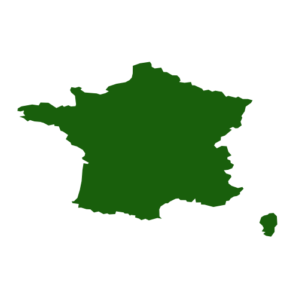
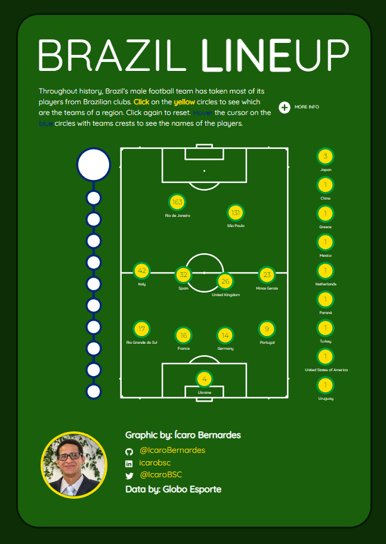

# Brazil Lineup

Dataviz on which clubs gave the most players to the male Brazilian Football team. This [page](https://icarobernardes.github.io/brazil_lineup/) has:

### Data on 488 draftings for the FIFA World Cups between 1932 and 2022

### Ranked list of the countries by number of ceded players

### List of clubs and the players they ceded

## The process

This dataviz was made with R, mostly `{ggiraph}`, in Quarto. I had to use some tricks to create this behaviour of "click and filter" data by country. I also had to make an effort to standardize the images: using `{ggpath}` to put them in the page and `{magick}` to manipulate images.

## Authorship

This dataviz was made by Ícaro Bernardes. To see more pieces like this follow me at:

- Twitter: [@IcaroBSC](https://twitter.com/icarobsc)
- Github: [@IcaroBernardes](https://github.com/IcaroBernardes)
- Linkedin: [@icarobsc](https://www.linkedin.com/in/icarobsc/)

Data was taken from [this](https://ge.globo.com/futebol/selecao-brasileira/noticia/2022/11/01/qual-clube-teve-mais-jogadores-convocados-pela-selecao-brasileira-para-copas-do-mundo.ghtml) Globo Esporte article.

